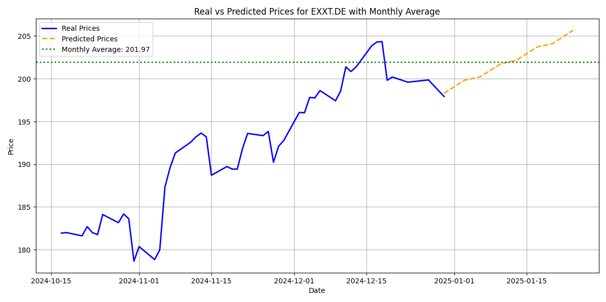

# ETF Prediction Project

## Overview
This project predicts the potential price gain or loss of Exchange Traded Funds (ETFs) for the next month based on historical data. It uses machine learning, specifically a Random Forest Regressor, to forecast percentage changes in price. The project dynamically fetches ETF data, processes it, and visualizes predictions with a focus on recent trends.

---

## Features

- **Dynamic ETF Selection**: The script dynamically selects ETFs to analyze.
- **Feature Engineering**: Incorporates multiple features like moving averages, exponential moving averages, and volatility.
- **Weighted Training**: Gives more importance to recent data trends during model training.
- **Visualizations**: Displays real vs. predicted prices along with the expected monthly average.

---

## How It Works

### 1. **Data Preparation**
The following features are calculated for each ETF:
- **Close**: Daily closing price.
- **Simple Moving Averages (SMA)**:
  - SMA_5: Average of the last 5 days.
  - SMA_10: Average of the last 10 days.
  - SMA_30: Average of the last 30 days.
- **Exponential Moving Averages (EMA)**:
  - EMA_10: Weighted average of the last 10 days.
  - EMA_30: Weighted average of the last 30 days.
- **Volatility**: Standard deviation of prices over the last 10 days.
- **Return**: Daily percentage change in price:
  
  ```math
  \text{Return} = \frac{P_t - P_{t-1}}{P_{t-1}}
  ```

---

### 2. **Machine Learning Model**
- **Model**: A Random Forest Regressor is used to predict the percentage change in price over the next 20 trading days.
- **Training**:
  - The model uses features like SMA, EMA, volatility, and closing prices.
  - Weighted training emphasizes recent data trends.
- **Target Variable**:
  
  ```math
  \text{Target} = \frac{P_{t+20} - P_t}{P_t}
  ```

- **Evaluation**:
  - Mean Squared Error (MSE) is used to evaluate model performance.

---

### 3. **Prediction and Visualization**
- **Predicted Daily Prices**:
  - Daily predictions are generated based on the monthly forecast.
  - Predicted prices are plotted alongside real historical data.
- **Monthly Average**:
  - The average predicted price for the month is calculated and displayed on the graph.
- **Visualization**:
  - The graph includes:
    - Real prices (solid blue line).
    - Predicted daily prices (dashed orange line).
    - Expected monthly average (dotted green line).

---

## How to Run

1. Clone the repository:
   ```bash
   git clone <repository-url>
   ```
2. Install dependencies:
   ```bash
   pip install -r dependencies.txt
   ```
3. Run the script:
   ```bash
   python main.py
   ```
4. View the predictions and graphs.

---

## Example Output

### Graph
The graph displays:
- Real Prices: Historical data for the last 50 trading days.
- Predicted Prices: Daily predictions for the next 20 trading days.
- Monthly Average: Expected average price for the prediction period.




### Console Output
- Predicted gain/loss for each ETF.
- Expected monthly average price for the top-gaining ETF.

---

## Disclaimer
>This project is for educational purposes only. It is not financial advice and was not developed by a professional in finance. Predictions generated by this project should not be used for investment decisions. Use at your own risk.

---

## Bibliography
1. Breiman, L. (2001). "Random Forests." Machine Learning 45(1): 5-32.
2. Yahoo Finance API - Historical Market Data: [https://finance.yahoo.com](https://finance.yahoo.com)
3. Moving Average Calculation: [Investopedia - Moving Averages](https://www.investopedia.com/terms/m/movingaverage.asp)
4. Python Data Science Handbook by Jake VanderPlas.
